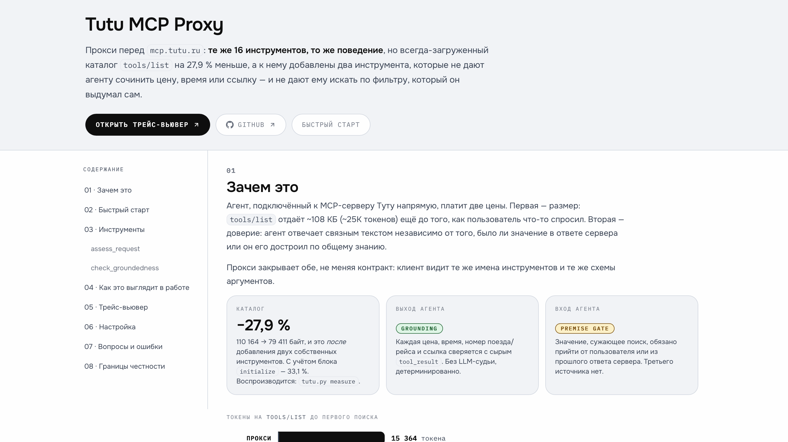

# tutu-mcp-proxy

[](https://github.com/Trum-ok/tutu-mcp-hackathon/actions/workflows/lint.yaml)
[](https://github.com/Trum-ok/tutu-mcp-hackathon/actions/workflows/lint-pages.yaml)
[](https://github.com/Trum-ok/tutu-mcp-hackathon/actions/workflows/tests.yaml)
[](https://github.com/Trum-ok/tutu-mcp-hackathon/actions/workflows/pages.yaml)

**[Docs](https://trum-ok.github.io/tutu-mcp-hackathon/)** | **[Trace-Viewer](https://trum-ok.github.io/tutu-mcp-hackathon/trace-viewer.html)**

Compacting/grounding MCP-прокси перед [`mcp.tutu.ru`](https://mcp.tutu.ru/mcp), сделан для
[хакатона Туту](https://hackathon2026.tutu.ru/) (трек 2 — «оптимизация инструментов»). Те же
16 инструментов, то же поведение — каталог легче, а два новых тула не дают агенту сочинить
цену или домыслить фильтр, которого никто не называл.

```
Токены на tools/list — цена, которую агент платит до первого поиска

  прокси     ███████████████▎            15 364
  без него   █████████████████████████   25 269
                                         −39 %
```

Не оценка: цифру вернул сам провайдер в `usage` на пробном запросе с полной поверхностью
инструментов. Эти 39 % агент платит на каждой сессии, ещё до того, как пользователь что-то
спросил.

- **Урезанный всегда-загруженный каталог.** `tools/list` короче на 28 %, схемы аргументов
  не тронуты.
- **`check_groundedness`.** Проверяет черновик ответа на выдумки, детерминированно и без
  LLM-судьи.
- **Premise gate + `assess_request`.** Не даёт агенту домыслить фильтр, которого никто не
  называл.
- **Пояснение к пустой выдаче.** Не путает «нет в продаже» с «поезд не ходит».
- **Mock-режим.** Работает без сети и без общего рейт-лимита хакатона.

Подробный разбор каждой фичи — [docs/features.md](docs/features.md).

## Трейс-вьювер

Каждый прогон эвалов превращается в один самодостаточный HTML-файл: двойной клик, без сервера
и без сети. Опубликованная витрина —
<https://trum-ok.github.io/tutu-mcp-hackathon/trace-viewer.html>.


```bash
make viewer        # из последнего настоящего прогона эвалов
make viewer-demo   # из рукописных демо-трейсов — без модели и без ключа
```

В интерфейсе: режим **обзор** — вся матрица сценариев × вариантов в одной таблице; **только
провалы** сужает список до упавшего; **бок о бок** ставит один сценарий из обоих вариантов
рядом, с подсветкой разошедшихся проверок. Клик по любому подсвеченному значению в ответе
открывает ящик с точным фрагментом ответа сервера, откуда оно взято, — или с прямой
констатацией, что его нет ни в одном из них. Синтетические прогоны (`demo:`/`scripted:`)
помечены янтарным бейджем «НЕ ЗАМЕР» — рукописную демонстрацию нельзя перепутать с измерением.

Как он собирается — [docs/deploy.md](docs/deploy.md#сборка-трейс-вьювера).

## Что получилось

Четыре прогона по 22 сценария на `gpt-5.6-luna` с `--effort low`, 19 августа 2026. Разброс
между прогонами — от самой модели: бэкенд один и тот же, набор сценариев тоже.

| Метрика                          | baseline    | proxy                       |
|----------------------------------|-------------|-----------------------------|
| Поверхность инструментов, токены | 25 269      | **15 364**                  |
| То же, байты                     | 115 329     | **74 971**                  |
| Задачный успех                   | 17–18 / 22  | **19–21 / 22**              |
| Обоснованность утверждений       | 97–98 %     | **99 %**                    |
| Выдуманных утверждений за прогон | 4           | **1**                       |
| Входных токенов за прогон        | 3,3–4,4 млн | **на 0,43–0,67 млн меньше** |
| Гейт предпосылок сработал        | 0           | 8–12                        |
| Лишних уточняющих вопросов       | 0           | **0**                       |

Строку про выдуманные утверждения стоит читать раньше процента: 4 выдумки из 189 проверяемых
утверждений и 1 из 184 — это 97,9 % против 99,5 %, разрыв выглядит как шум. В абсолюте это
вчетверо меньше неверных фактов, дошедших до пользователя, а получает он именно их, а не
процент. Проценты считаются от проверяемых утверждений: порог, который пользователь назвал сам
(«дешевле 3000 ₽»), payload подтверждать не обязан и в знаменатель не входит.

Диапазоны в таблице — поведение модели: поверхность статична, всё остальное меняется от
прогона к прогону.

Последняя строка важна не меньше первой: гейт срабатывал 8–12 раз за прогон и при этом **ни
разу** не задал вопрос на сценарии, где спрашивать было не о чем (негативный контроль
`no_overask` плюс проверка `did_not_over_ask`). Механизм, который уточняет всё подряд, набрал бы
идеальные премис-метрики и испортил бы продукт.

Расходятся варианты на пяти сценариях, и все пять выигрывает proxy: пустая отфильтрованная
выдача не читается как «поезд не ходит», опечатка в дне недели ловится до поиска, молча
подставленное число гостей останавливает гейт, места рядом ищутся правильным инструментом.
Единственный устойчивый провал proxy — `multitransport_basic`: агент печатает разницу цен
(2 275,07 − 1 700 = 575), обе половины которой подтверждены, а само число в payload
отсутствует. Отличить такую арифметику от неверной (умножить цену отеля на число ночей —
отдельный сценарий, и там это ошибка) детерминированная проверка не может; это граница метода,
а не дефект прокси.

Две вещи для честности отчёта: **промахи фикстур считаются отдельно от ошибок тулов** — дыра в
записи не должна читаться как сбой Туту; и **числа токенов помечены `~`, если это оценка** —
у OpenAI нет эндпоинта подсчёта токенов, точная цифра берётся из одного реального пробного
запроса (`usage.prompt_tokens`), `--estimate-tokens` подставляет вместо этого offline-оценку
tiktoken.

Модель и усилие рассуждения — за прогон (`--model`/`OPENAI_MODEL`, `--effort`/`OPENAI_EFFORT`);
без обоих поле `reasoning` вообще не отправляется, и модель применяет своё умолчание — это не
то же самое, что явное `--effort none`. Раннер по умолчанию бьёт в `/v1/responses` — Chat
Completions не берёт function tools вместе с рассуждением у текущих reasoning-моделей; `--api
chat` — для OpenAI-совместимых шлюзов без `/v1/responses`. Сопоставление фикстур игнорирует
значения по умолчанию из `inputSchema` (модель выписывает `page: 1`, `sort: "price_asc"` и
так далее там, где человек, записывая фикстуру, ничего не пишет) — иначе почти каждый вызов в
прогоне с моделью промахивался бы мимо записи.

Как устроен прогон, что считает каждая метрика и почему самопроверка харнесса стоит в CI —
[docs/evals.md](docs/evals.md).

## Быстрый старт

Нужны [uv](https://docs.astral.sh/uv/) и Python ≥ 3.13 (его поставит сам `uv sync`).

```bash
git clone https://github.com/Trum-ok/tutu-mcp-hackathon
cd tutu-mcp-hackathon
uv sync
uv run python tutu.py serve            # mock-режим (по умолчанию) — http://127.0.0.1:8800/mcp
```

```bash
TUTU_PROXY_MODE=live uv run python tutu.py serve   # проксирует настоящий mcp.tutu.ru
```

Любой MCP-клиент — на `http://127.0.0.1:8800/mcp` (Streamable HTTP, без авторизации, как у
upstream). Ниже `<URL>` — этот адрес либо адрес развёрнутого прокси (см.
[docs/deploy.md](docs/deploy.md)).

```bash
claude mcp add --transport http tutu <URL>          # Claude Code
```

```jsonc
// Cursor · ~/.cursor/mcp.json
{ "mcpServers": { "tutu": { "url": "<URL>" } } }

// Claude Desktop · claude_desktop_config.json — через mcp-remote, он не умеет HTTP напрямую
{ "mcpServers": { "tutu": { "command": "npx", "args": ["-y", "mcp-remote", "<URL>"] } } }
```

**Что должно получиться.** В логе — две строки: режим и адрес прослушивания. Клиент после
подключения показывает **18 инструментов**: 16 родных Туту плюс `assess_request` и
`check_groundedness`. Если их 16 — клиент подключился к самому Туту, а не к прокси.

## Сколько удалось срезать

`tools/list`: 110 164 → 79 411 байт (**−27.9 %**), а с учётом `initialize`-инструкций каждой
стороны — **−33.1 %** (прокси отдаёт свой блок инструкций на 1,9 КБ вместо 11,2 КБ у Туту).
Обе цифры — уже после добавления двух своих тулов (`assess_request` 1 313 байт,
`check_groundedness` 1 100).

Разбивка по слоям каталога, названная цена сжатия и граница, за которую сознательно не пошли —
[docs/compaction.md](docs/compaction.md).

## Документация

Пользовательский разбор — отдельная страница: `make docs` собирает `site/index.html`, либо
открывайте уже опубликованную: <https://trum-ok.github.io/tutu-mcp-hackathon/>.



| Файл                                           | О чём                                              |
|------------------------------------------------|----------------------------------------------------|
| [docs/features.md](docs/features.md)           | подробный разбор каждой фичи из шапки README       |
| [docs/findings.md](docs/findings.md)           | сырые замеры по живому серверу и мотивирующий кейс |
| [docs/compaction.md](docs/compaction.md)       | что именно сжимается, чем платят, чего не делали   |
| [docs/evals.md](docs/evals.md)                 | устройство эвал-харнесса, фикстуры, снимок прогона |
| [docs/structure.md](docs/structure.md)         | структура репозитория и направление зависимостей   |
| [docs/configuration.md](docs/configuration.md) | переменные окружения и все make-цели               |
| [docs/deploy.md](docs/deploy.md)               | Docker, Render, GitHub Pages, сборка обеих страниц |

## Команда rezo

- **Артамонов Аркадий**     ([@OpSonata](https://t.me/OpSonata))

## Лицензия

[MIT](LICENSE)
