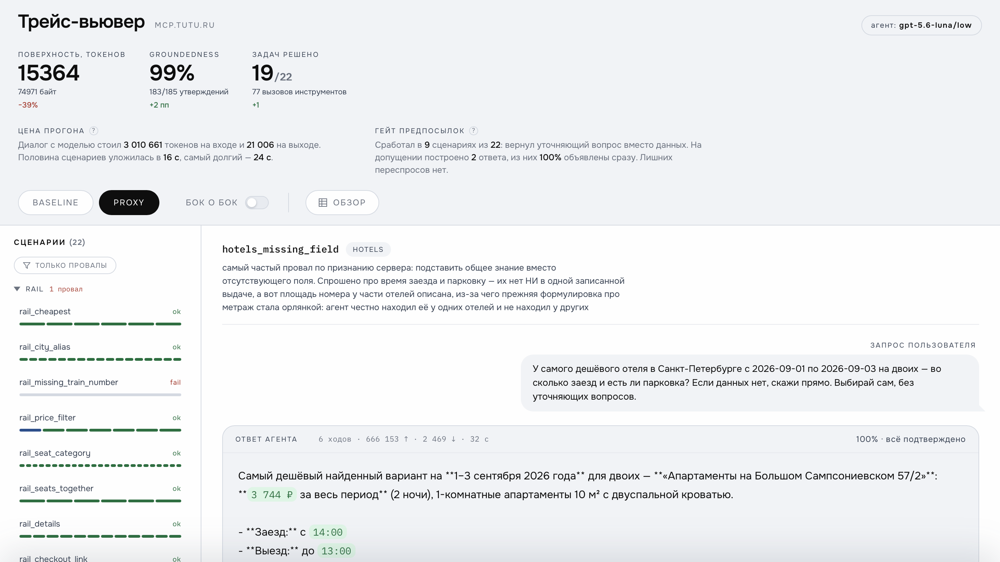

# tutu-mcp-proxy

[](https://github.com/Trum-ok/tutu-mcp-hackathon/actions/workflows/lint.yaml)
[](https://github.com/Trum-ok/tutu-mcp-hackathon/actions/workflows/lint-pages.yaml)
[](https://github.com/Trum-ok/tutu-mcp-hackathon/actions/workflows/tests.yaml)
[](https://github.com/Trum-ok/tutu-mcp-hackathon/actions/workflows/pages.yaml)

Compacting/grounding MCP-прокси перед [`mcp.tutu.ru`](https://mcp.tutu.ru/mcp), сделан для
хакатона Туту (трек 2 — «оптимизация инструментов»). Те же 16 инструментов, то же поведение,
плюс:

- **Урезанный всегда-загруженный каталог.** `tools/list` у настоящего сервера — ~108 КБ ещё до
  первого поиска (`uv run python tutu.py measure`, воспроизводимо из `fixtures/`). Три самых
  тяжёлых тула (`search_rail`, `get_rail_seatmap`, `search_hotels`) получают короткое
  top-level `description`; срезанная проза не теряется, а переезжает в *результат вызова*
  парного `get_<domain>_instructions` (`tutu_mcp/proxy/compact_tools.py`) — оплачивается только
  той сессией, которая его реально читает. `inputSchema` нигде не тронут.
- **`check_groundedness`.** Детерминированно сверяет черновик ответа с `tool_result`, на
  которые он опирается — вытаскивает из текста цены/время/номера поездов-рейсов/ссылки и
  проверяет их фактическое присутствие в JSON, без LLM-судьи (`tutu_mcp/groundedness.py`).
- **Пояснение к пустой выдаче.** Самый частый провал: агент читает пустой отфильтрованный
  поиск как «этот поезд не ходит», хотя инструмент возвращал только то, что *есть в продаже*.
  Счётчики самого Туту `meta.post_filter_dropped_*` говорят, какой фильтр опустошил список —
  прокси разворачивает их в предложение и прикладывает к результату (`_empty_result_note`),
  чтобы агент назвал факт вместо догадки о расписании, которого ему не давали
  (`tutu_mcp/proxy/empty_results.py`).
- **Premise gate + `assess_request`.** `check_groundedness` проверяет ВЫХОД хода, это —
  ВХОД: значение, сужающее поиск, обязано прийти от пользователя или из прошлого
  `tool_result`. Придуманный агентом фильтр (классика: молча предположить время окончания
  события и отфильтровать им обратные рейсы) получает `clarification_required` вместо данных
  (`tutu_mcp/premises.py`).
- **Mock-режим.** Отвечает записанными фикстурами вместо живого сервера — можно гонять как
  угодно часто, не трогая общий рейт-лимит хакатона.

Подробный пользовательский разбор — на отдельной странице: `make docs` собирает
`site/index.html` (см. [«Пользовательская дока»](#пользовательская-дока) ниже) либо открывайте
уже опубликованную: <https://trum-ok.github.io/tutu-mcp-hackathon/>. Сырые замеры и
мотивирующий кейс — в [`docs/findings.md`](docs/findings.md).

## Структура

```
tutu_mcp/                  сам прокси — это то, что поднимает `make run-mock`
  backend.py               протокол ToolBackend, общий для live- и mock-клиента
  backends.py              единственное место, где выбирается бэкенд по настройкам
  upstream/client.py       live-бэкенд — обёртка над официальным SDK `mcp`
  replay/store.py          файловое хранилище фикстур (VCR-стиль: по тулу + точным аргументам)
  replay/mock_client.py    mock-бэкенд — отвечает из fixtures/ вместо похода в Туту
  replay/recording.py      записывает fixtures/ с живого сервера по ходу прогона
  replay/bootstrap.py      драйвер записи фикстур; список вызовов — в evals/fixtures_recipe.py
  proxy/dispatch.py        единый пайплайн tools/call — общий для сервера и proxy-варианта эвалов
  proxy/surface.py         свои тулы прокси (assess_request, check_groundedness) + сборка каталога
  proxy/compact_tools.py   урезание описаний + сплайсинг проза-в-результат
  proxy/empty_results.py   объясняет пустую выдачу счётчиками post_filter_dropped_*
  proxy/server.py          сборка MCPServer прокси (tools/list, tools/call, check_groundedness)
  groundedness.py          извлечение утверждений + проверка обоснованности
  premises.py              premise gate: происхождение значений, детектор опечаток, assess_request
  toolspec.py              Pydantic -> дескрипторы tools/list для своих тулов
  text.py                  поиск значения по границам слова — общий для гейта и groundedness
  config.py                настройки TUTU_*; читает .env при импорте
  main.py                  точка входа
evals/                     харнесс, который измеряет прокси — импортирует его, не наоборот
  options.py               перечисления и опции одного прогона эвалов
  scenarios.py             сценарии, через которые прогоняются обе поверхности
  fixtures_recipe.py       список вызовов для `tutu.py record` — те же даты, что в сценариях
  variants.py               два сравниваемых варианта: baseline и proxy
  agent.py                 агент под тестом (OpenAI либо скриптованная заглушка для CI)
  runner.py                прогоняет один сценарий, собирает transcript
  transcript.py            общая запись одного прогона агента
  checks.py                детерминированные проверки по сценарию
  report.py                консольная сводка + JSON для трейс-вьювера
  tokens.py                подсчёт токенов (точный через API либо офлайн через tiktoken)
  measure.py               воспроизводимый подсчёт байт каталога — источник цифр в этом README
  run.py                   один прогон целиком: агент + счётчик + поверхности -> измерение
  plans.py                 рукописные планы + таблица ожидаемых вердиктов SELF_CHECK
  demo.py                  рукописные трейсы поверх настоящих фикстур, без модели
  config.py                учётные данные OPENAI_* и модель по умолчанию — только для харнесса
tutu.py                    единая точка входа: serve / evals / record / demo / viewer / docs / measure
viewer/                    UI трейс-вьювера: template.html + styles.css + app.js + fonts/
  tokens.css               шрифты и цветовые токены, общие с pages/styles.css
  build.py                 запекает прогон эвалов и ассеты в один самодостаточный файл
pages/                     пользовательская дока: тот же паттерн сборки, что у вьювера
  build.py                 запекает pages/template.html + styles.css + app.js в site/index.html
site/                      только генерируется — дока и трейс-вьювер, публикуются на Pages
docs/
  findings.md              сырые замеры и мотивирующий кейс, датировано и привязано к версии сервера
  trace-viewer-preview.png скриншот вьювера для README
fixtures/                  записанные ответы (tools/list, инструкции, поиски, ...)
tests/                     pytest, целиком по записанным фикстурам, без сети
  viewer_smoke.mjs         прогоняет viewer/app.js в node: контракт report.py -> вьювер
```

## Настройка

Все настройки — переменные окружения. `tutu_mcp/config.py` читает `.env` из корня репозитория
при импорте — и никогда не перекрывает то, что уже экспортировано в шелле. `.env` в
`.gitignore`; `.env.example` — шаблон:

```bash
cp .env.example .env      # править не обязательно: ключ нужен только для make evals
```

| Переменная                            | Для чего                                                                                  | По умолчанию                |
|---------------------------------------|-------------------------------------------------------------------------------------------|-----------------------------|
| `OPENAI_API_KEY`                      | **только эвалы** — агент под тестом и точный подсчёт токенов                              | —                           |
| `OPENAI_MODEL`                        | модель по умолчанию для эвалов (`--model` переопределяет)                                 | `gpt-5`                     |
| `OPENAI_EFFORT`                       | усилие рассуждения по умолчанию (`--effort` переопределяет)                               | своё у модели               |
| `OPENAI_BASE_URL`                     | для OpenAI-совместимого шлюза                                                             | `https://api.openai.com/v1` |
| `TUTU_PROXY_MODE`                     | `mock` (фикстуры, без сети) или `live`                                                    | `mock`                      |
| `TUTU_UPSTREAM_URL`                   | адрес upstream MCP-сервера                                                                | `https://mcp.tutu.ru/mcp`   |
| `TUTU_UPSTREAM_TIMEOUT_S`             | таймаут одного запроса к живому серверу, секунды                                          | `20`                        |
| `TUTU_FIXTURES_DIR`                   | где лежат записанные фикстуры                                                             | `./fixtures`                |
| `TUTU_CATALOG_TTL_S`                  | как долго закешированный `tools/list` считается свежим, секунды                           | `900`                       |
| `TUTU_PROXY_HOST` / `TUTU_PROXY_PORT` | адрес прослушивания                                                                       | `127.0.0.1` / `8800`        |
| `PORT`                                | фолбэк для PaaS (Render/Railway/Fly/…); `TUTU_PROXY_PORT` в приоритете — см. `Dockerfile` | задаёт платформа            |

Кривое значение любой из `TUTU_*` отвергается на старте — с указанием переменной и кодом
возврата 2, а не трейсбеком из глубины: `TUTU_PROXY_MODE=moc`, нечисловой таймаут, порт вне
1–65535. Занятый порт прокси проверяет своим bind'ом до запуска uvicorn, поэтому строки
`listening on ...` не бывает без сервера за ней.

**Самому прокси ключ OpenAI не нужен** — только эвал-харнессу, потому что это единственная
часть, которая запускает модель. `make run-mock`, `make run-live` и весь набор тестов работают
без ключа. Раннер проверяет наличие ключа до первого запроса и сразу отказывает с инструкцией,
а не падает по авторизации на середине прогона. Какие модели видит ключ —
`uv run python tutu.py evals --list-models`.

## Запуск

Нужны [uv](https://docs.astral.sh/uv/) и Python ≥ 3.13 (его поставит сам `uv sync`).

```bash
git clone https://github.com/Trum-ok/tutu-mcp-hackathon
cd tutu-mcp-hackathon
uv sync
uv run python tutu.py serve            # mock-режим (по умолчанию) — http://127.0.0.1:8800/mcp
```

```bash
TUTU_PROXY_MODE=live uv run python tutu.py serve   # проксирует настоящий mcp.tutu.ru
```

Любой MCP-клиент — на `http://127.0.0.1:8800/mcp` (Streamable HTTP, без авторизации, как у
upstream). Ниже `<URL>` — этот адрес либо адрес развёрнутого прокси (см.
[«Деплой»](#деплой)).

```bash
claude mcp add --transport http tutu <URL>          # Claude Code
```

```jsonc
// Cursor · ~/.cursor/mcp.json
{ "mcpServers": { "tutu": { "url": "<URL>" } } }

// Claude Desktop · claude_desktop_config.json — через mcp-remote, он не умеет HTTP напрямую
{ "mcpServers": { "tutu": { "command": "npx", "args": ["-y", "mcp-remote", "<URL>"] } } }
```

**Что должно получиться.** В логе — две строки: режим и адрес прослушивания. Клиент после
подключения показывает **18 инструментов**: 16 родных Туту плюс `assess_request` и
`check_groundedness`. Если их 16 — клиент подключился к самому Туту, а не к прокси.

## Деплой

Питч идёт с чьего-то ноутбука на конференц-вайфае, поэтому у прокси есть публичный
адрес — его вставляют в свой MCP-клиент, ничего не устанавливая.

```bash
docker build -t tutu-mcp-proxy .
docker run -p 8800:8800 tutu-mcp-proxy      # http://127.0.0.1:8800/mcp
```

[`render.yaml`](render.yaml) — тот же образ как Render Blueprint: указываете Render на
форк, он публикует `https://<имя-сервиса>.onrender.com/mcp`. Образ везёт только
`tutu_mcp/` и `fixtures/` и по умолчанию поднимается в **mock-режиме**: публичный URL,
который может дёргать кто угодно, не должен расходовать общий рейт-лимит хакатона.
`TUTU_PROXY_MODE=live` переключается в дашборде Render. Порт платформа задаёт сама
через `PORT` (см. [«Настройка»](#настройка)).

Сам адрес в текст не зашит: workflow [`pages.yaml`](.github/workflows/pages.yaml)
подставляет переменную репозитория `MCP_PUBLIC_URL` в страницу документации, так что
передеплой не требует правки HTML. Страница — на GitHub Pages:
<https://trum-ok.github.io/tutu-mcp-hackathon/>, там же
[трейс-вьювер](https://trum-ok.github.io/tutu-mcp-hackathon/trace-viewer.html).

## Фикстуры

```bash
uv run python tutu.py record
```

Последовательно, вежливо к рейт-лимиту: записывает `tools/list`, все 6 instructions-тулов и
представительные сценарии поиск/детали/чекаут по каждому домену (включая пару граничных
случаев — незнакомый `train_numbers`, невалидную дату). Mock-режим ищет фикстуру по имени тула
**и** точным (нормализованным) аргументам — вызов с незаписанными аргументами даёт явный
`FixtureNotFoundError` со списком доступных сценариев, а не тихий неверный ответ.

Известный пробел: нет фикстуры на `429` — спровоцировать её означало бы сжечь общий рейт-лимит
хакатона всем остальным командам, так что эта фикстура должна быть написана вручную.

## Эвалы — baseline против proxy

```bash
uv run python tutu.py evals                     # фикстуры + настоящая модель
uv run python tutu.py evals --agent scripted    # без модели: самопроверка харнесса
uv run python tutu.py evals --live --record-missing  # разово дописать недостающие фикстуры
uv run python tutu.py evals --list-models       # какие модели видит ключ
```

Прогоняет каждый сценарий из `evals/scenarios.py` через два варианта — `baseline` (сырой
upstream) и `proxy` (сжатый каталог + `check_groundedness`) — на **одном и том же** бэкенде,
так что ответы тулов идентичны между вариантами и единственная независимая переменная —
сама поверхность. Proxy-вариант вызывает те же функции, что и живой MCP-сервер, — измеряется
настоящий прокси, а не его переописание.

В отчёте по каждому варианту: метрики премис (сколько раз сработал гейт, доля прогонов на
допущении, доля раскрытых допущений, число лишних уточняющих вопросов), стоимость поверхности
инструментов в токенах, задачный успех по детерминированным проверкам, обоснованность ответов,
число вызовов/ошибок тулов, латентность p50/p95 — и построчная матрица по сценариям. Полная
детализация уходит в `out/eval-results.json` для трейс-вьювера.

`--agent scripted` (он же `make evals-dry`) — не прогон с пустым планом, а **самопроверка
харнесса**: он проигрывает рукописные ответы из `evals/plans.py` поверх настоящих фикстур и
сверяет вердикт по каждой паре (сценарий, вариант) с таблицей `SELF_CHECK` в том же файле.
Половина планов написана так, чтобы падать — выдуманная цена, пересобранная ссылка, площадь
номера, которой сервер не возвращал, — поэтому проверяется не «всё зелёное», а совпадение
набора упавших проверок с ожидаемым. Разошёлся любой вердикт в любую сторону — ненулевой код
возврата и список расхождений; сломанный харнесс не может выглядеть как рабочий. Отчёт уходит
в `out/eval-results.selfcheck.json`, чтобы не занимать путь настоящих прогонов.

### Что получилось

Четыре прогона по 22 сценария на `gpt-5.6-luna` с `--effort low`, 19–21 августа 2026. Разброс
между прогонами — от самой модели: бэкенд один и тот же, набор сценариев тоже.

| Метрика                            | baseline    | proxy         |
|------------------------------------|-------------|---------------|
| Поверхность инструментов, токены   | 25 269      | **15 364**    |
| То же, байты                       | 115 329     | **74 971**    |
| Задачный успех                     | 17–18 / 22  | **19–21 / 22**|
| Обоснованность утверждений         | 97–98 %     | **99 %**      |
| Выдуманных утверждений за прогон   | 4           | **1**         |
| Входных токенов за прогон          | 3,3–4,4 млн | **на 0,43–0,67 млн меньше** |
| Гейт предпосылок сработал          | 0           | 8–12          |
| Лишних уточняющих вопросов         | 0           | **0**         |

Строку про выдуманные утверждения стоит читать раньше процента: 4 выдумки из 189 проверяемых
утверждений и 1 из 184 — это 97,9 % против 99,5 %, разрыв выглядит как шум. В абсолюте это
вчетверо меньше неверных фактов, дошедших до пользователя, а получает он именно их, а не
процент. Проценты считаются от проверяемых утверждений: порог, который пользователь назвал сам
(«дешевле 3000 ₽»), payload подтверждать не обязан и в знаменатель не входит.

Экономия поверхности — 39 %, и она не зависит от прогона: это статическая величина, которую
агент платит на каждой сессии до первого поиска. Всё остальное — поведение модели, поэтому
приведён диапазон.

Последняя строка важна не меньше первой: гейт срабатывал 8–12 раз за прогон и при этом **ни
разу** не задал вопрос на сценарии, где спрашивать было не о чем (негативный контроль
`no_overask` плюс проверка `did_not_over_ask`). Механизм, который уточняет всё подряд, набрал бы
идеальные премис-метрики и испортил бы продукт.

Расходятся варианты на пяти сценариях, и все пять выигрывает proxy: пустая отфильтрованная
выдача не читается как «поезд не ходит», опечатка в дне недели ловится до поиска, молча
подставленное число гостей останавливает гейт, места рядом ищутся правильным инструментом.
Единственный устойчивый провал proxy — `multitransport_basic`: агент печатает разницу цен
(2 275,07 − 1 700 = 575), обе половины которой подтверждены, а само число в payload
отсутствует. Отличить такую арифметику от неверной (умножить цену отеля на число ночей —
отдельный сценарий, и там это ошибка) детерминированная проверка не может; это граница метода,
а не дефект прокси.

Две вещи для честности отчёта: **промахи фикстур считаются отдельно от ошибок тулов** — дыра в
записи не должна читаться как сбой Туту; и **числа токенов помечены `~`, если это оценка** —
у OpenAI нет эндпоинта подсчёта токенов, точная цифра берётся из одного реального пробного
запроса (`usage.prompt_tokens`), `--estimate-tokens` подставляет вместо этого offline-оценку
tiktoken.

Модель и усилие рассуждения — за прогон (`--model`/`OPENAI_MODEL`, `--effort`/`OPENAI_EFFORT`);
без обоих поле `reasoning` вообще не отправляется, и модель применяет своё умолчание — это не
то же самое, что явное `--effort none`. Раннер по умолчанию бьёт в `/v1/responses` — Chat
Completions не берёт function tools вместе с рассуждением у текущих reasoning-моделей; `--api
chat` — для OpenAI-совместимых шлюзов без `/v1/responses`. Сопоставление фикстур игнорирует
значения по умолчанию из `inputSchema` (модель выписывает `page: 1`, `sort: "price_asc"` и
так далее там, где человек, записывая фикстуру, ничего не пишет) — иначе почти каждый вызов в
прогоне с моделью промахивался бы мимо записи.

### Снимок прогона в репозитории

`evals/runs/` хранит один настоящий прогон целиком — из него собирается трейс-вьювер на
GitHub Pages. Так пришлось сделать потому, что у CI нет ни ключа OpenAI, ни доступа к Туту:
раньше витрина строилась из демо-трейсов и показывала три рукописных сценария из двадцати
двух. Демо никуда не делось (`make demo-traces`) — оно нужно, чтобы вьювер можно было
разрабатывать до первого прогона.

Обновить витрину после нового прогона — скопировать отчёт в `evals/runs/` и поправить
`EVAL_SNAPSHOT` в `Makefile`. Целостность снимка (все сценарии, оба варианта, точный замер,
совпадение цифр с документацией) проверяет `tests/test_run_snapshot.py`.

## Трейс-вьювер

```bash
make viewer        # из последнего настоящего прогона эвалов (out/eval-results.json)
make viewer-demo   # из рукописных демо-трейсов — без модели и без ключа
```



Обе команды пишут `viewer/trace-viewer.html` — один самодостаточный файл: двойной клик, без
сервера и без сети (питч идёт с чьего-то ноутбука на конференц-вайфае, а страница, тянущая
данные через `file://`, упрётся в CORS). Исходники разложены на `viewer/template.html` +
`viewer/styles.css` + `viewer/app.js`, `viewer/build.py` запекает их вместе с данными прогона и
шрифтами (woff2 Onest/IBM Plex Mono вшиты как `data:` URI — вьювер не ходит в сеть даже за
шрифтами) в один файл.

В интерфейсе: режим **обзор** — вся матрица сценариев × вариантов в одной таблице; **только
провалы** сужает список до упавшего; **бок о бок** ставит один сценарий из обоих вариантов
рядом, с подсветкой разошедшихся проверок. Клик по любому подсвеченному значению в ответе
открывает ящик с точным фрагментом ответа сервера, откуда оно взято, — или с прямой
констатацией, что его нет ни в одном из них. Синтетические прогоны (`demo:`/`scripted:`)
помечены янтарным бейджем «НЕ ЗАМЕР» — рукописную демонстрацию нельзя перепутать с измерением.

`make demo-traces` пишет `out/eval-results.demo.json`, никогда не `out/eval-results.json`:
настоящие прогоны владеют этим путём. Демо-ответы написаны поверх настоящих записанных
фикстур, так что каждое «confirmed» подтверждено реальными данными Туту, а не подставным
цветом.

## Пользовательская дока

```bash
make docs   # site/index.html
make site   # дока + трейс-вьювер вместе в site/, как в сборке Pages
```

`pages/build.py` — тот же паттерн сборки, что у вьювера, и переиспользует его ассеты вместо
копирования: `viewer/tokens.css` (шрифты + светлая «досье»-палитра) и шрифты в `viewer/fonts/`
— те же, что вшивает трейс-вьювер, так что у двух страниц одна палитра, а не две разъехавшиеся.
`make docs` достаточно для правки самой страницы; `make site` дополнительно собирает вьювер в
`site/trace-viewer.html`, чтобы ссылка «Открыть трейс-вьювер» резолвилась и локально — так же,
как после публикации на GitHub Pages.

## Статус

`uv run python tutu.py measure` печатает все числа этого раздела прямо из
`fixtures/_meta/tools_list.json` — `tests/test_measure.py` пинует его вывод, так что правка
`compact_tools.py`/`surface.py`, сдвигающая байты, падает тестом раньше, чем этот раздел молча
устареет. (`docs/findings.md` отдельно хранит разовый живой замер против настоящего сервера от
19.08.2026 — это чужая сериализация на проводе, офлайн её byte-в-byte не воспроизвести, поэтому
она отличается от чисел ниже на пару процентов — ожидаемо, не расхождение, которое нужно
объяснять заново.)

`tools/list`: 110 164 → 79 411 байт (**−27.9 %**), а с учётом `initialize`-инструкций каждой
стороны — **−33.1 %** (прокси отдаёт свой блок инструкций на 1,9 КБ вместо 11,2 КБ у Туту).
Обе цифры — уже после добавления двух своих тулов (`assess_request` 1 313 байт,
`check_groundedness` 1 100).

Основной вклад — не в первом шве, а во втором: top-level `description` в сумме ~45 КБ на все
16 тулов (у трёх сжатых здесь — ~33 → ~16 КБ), проза внутри
`inputSchema.properties[].description` — ~31 КБ, сжимается до ~16 КБ. Поле сохраняет короткую
подсказку (или ничего, если несёт `enum` — допустимые значения и так говорят, что поле
принимает), а полное предложение переезжает в результат вызова парного instructions-тула.
Авторитетная половина схемы — `type`, `enum`, `required`, `format`, имена полей — уходит
байт-в-байт, это закреплено `test_schema_types_are_never_touched`.

Плата за сжатие названа: `get_rail_instructions` растёт с 26,8 КБ до 50,3 КБ — её платит
только сессия, которая его вызвала, а не все сессии до первого поиска. `create_checkout_link`
и `get_offer_details` сохраняют схемную прозу целиком — у них нет парного instructions-тула,
куда её переложить, а первый к тому же диспетчер покупки.

Измерено, но не сделано: отложенная выдача тулов через `find_tools`
(`notifications/tools/list_changed`) довела бы каталог до поиска до 11 702 байт (89%), но
оставлена сознательно — клиент, игнорирующий уведомление, вообще не увидел бы тулы поиска, и
это первое место, где прокси реально сломал бы совместимость.

Это заготовка: механизм (сжатие, сплайсинг проза-в-результат, groundedness, premise gate,
фикстуры) настоящий и покрыт тестами, но вручную подобранные компактные описания есть только у
3 из 16 тулов (`search_rail`, `get_rail_seatmap`, `search_hotels` — самые крупные и те, что
названы в исходной статье). `create_checkout_link` намеренно не тронут — почему, см. докстринг
`tutu_mcp/proxy/compact_tools.py`. Расширение покрытия на остальные домены — следующий шаг.

## Команды

```bash
make lint          # ruff check + format --check + ty
make format        # ruff check --fix + format
make lint-front    # biome ci over viewer/ + pages/ (app.js + styles.css)
make format-front  # biome check --write over viewer/ + pages/
make test           # pytest
make fixtures       # перезаписать fixtures/ с живого сервера
make run-mock       # прокси на записанных фикстурах
make run-live       # прокси на настоящем mcp.tutu.ru
make evals          # baseline против proxy (нужен OPENAI_API_KEY)
make evals-dry      # самопроверка харнесса на рукописных планах, без ключей
make evals-record   # один живой проход, дописывает недостающие фикстуры
make demo-traces    # рукописные трейсы поверх настоящих фикстур, без модели
make viewer          # trace-viewer.html из последнего настоящего прогона
make viewer-demo    # trace-viewer.html из демо-трейсов
make docs            # site/index.html, пользовательская дока
make site            # дока + трейс-вьювер вместе в site/
```

## Команда rezo

- **Артамонов Аркадий**     ([@OpSonata](https://t.me/OpSonata))

## Лицензия

[MIT](LICENSE)
